# Obsidian on Mobile without using Sync on iOS

Ever since I started using Obsidian back in college for note-taking, I wanted to be able to add notes from my iPhone or iPad. But paying for Obsidian Sync wasn't an option, and I didn't want to create notes on mobile without being able to access them on my computer as well.

Later, after starting my business, I wanted to set up a project tracker and decided to use Obsidian again. I ran into the same issue with mobile syncing, but this time I came across an obscure [forum post](https://forum.obsidian.md/t/mobile-setting-up-ios-git-based-syncing-with-mobile-app-using-working-copy/16499).

I finally had a way to sync between my computer and iPhone for free. This post will cover much of what the forum post shared, along with the changes and updates I made while setting it up.

## What you need

- A Git account (GitHub, GitLab, etc.)
- [Obsidian Mobile](https://apps.apple.com/us/app/obsidian-connected-notes/id1557175442)
- [Working Copy](https://apps.apple.com/us/app/working-copy-git-client/id896694807)

---
## Step 1: Create a Git Repo

On the service of your choice (GitHub, GitLab, etc.), create a new repository. If you already have an obsidian vault on desktop, you can link the vault to the repo. Or just use a repo that is already being used for a vault.

## Step 2: Create a Vault on mobile

No matter if the repo is empty or started, you are going to need to create a new vault on mobile. However, if you have a vault already started on mobile that you wish to use, you can skip to [Step 3: Link Vault to Repo](#step-3-link-vault-to-repo).

1. Open up the Obsidian mobile app on your device
2. If this is your first time doing so you will be greeted by the new vault screen. If not you will need to go into the menu and choose to create a new vault.
3. Press the `Create a vault` button

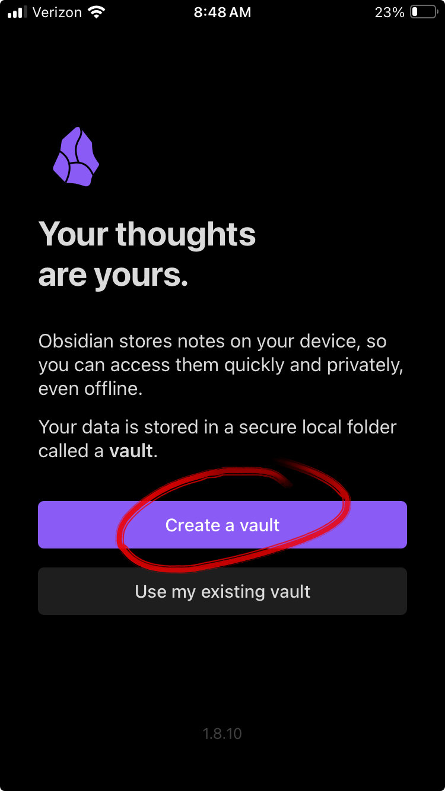
4. Don't set up Sync—skip it, since that's a different service than what we're using here

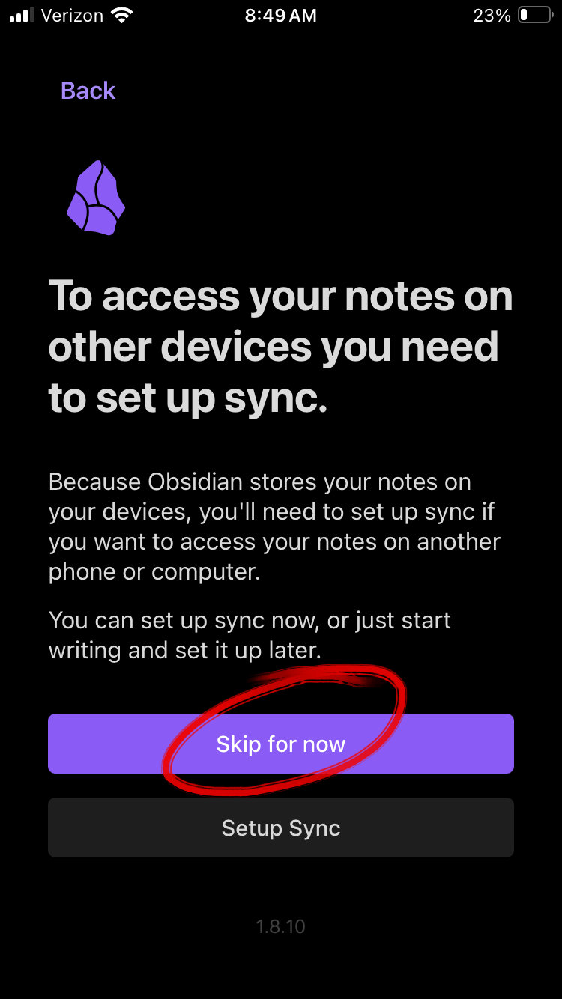
5. Name your new vault and create it

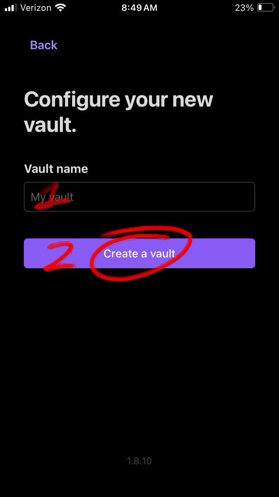

## Step 3: Link Vault to Repo

The heavy lifting of this project is going to be done by Working Copy. I hadn't found any good Git apps for iOS before this. You can use it completely for free and it doesn't even push ads.

1. Open the Working copy app
2. Click on the fingerprint icon on the homepage
3. Select the Link external repository. Before you login to a Git provider the button will have a lock emoji. Don't worry about it.

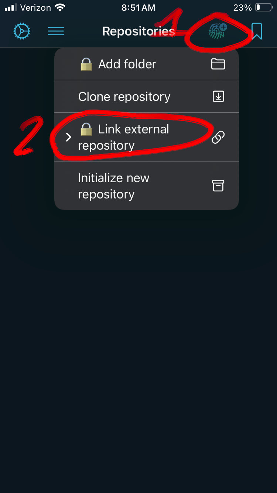
4. Select your provider and login
5. Search for the repository name of the one you created from [Step 1: Create a Git Repo](#step-1-create-a-git-repo)
6. Select the correct repository

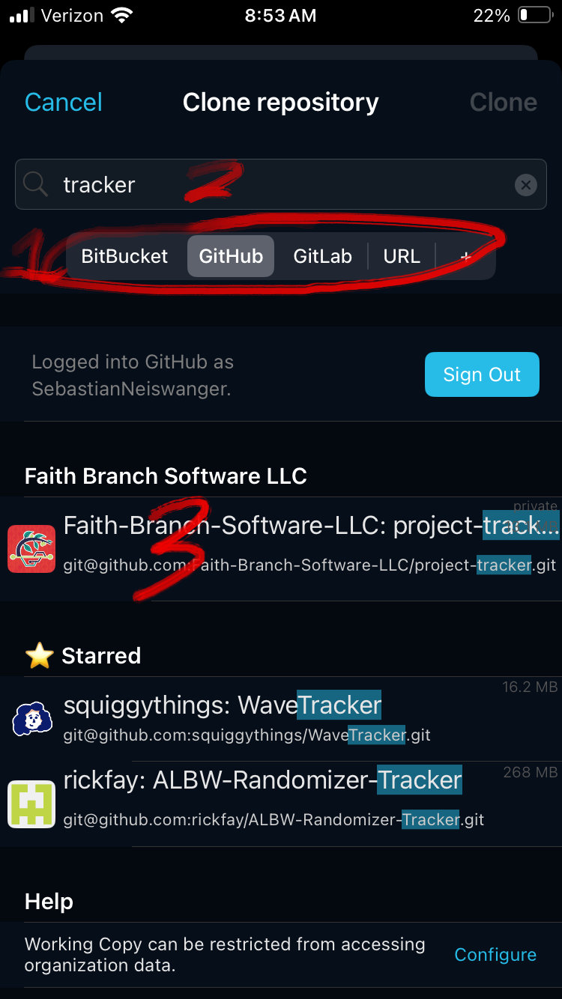
7. You now have a copy of the repo on the app. It should open right after cloning.
8. Select the Repository button from the inside of the repository

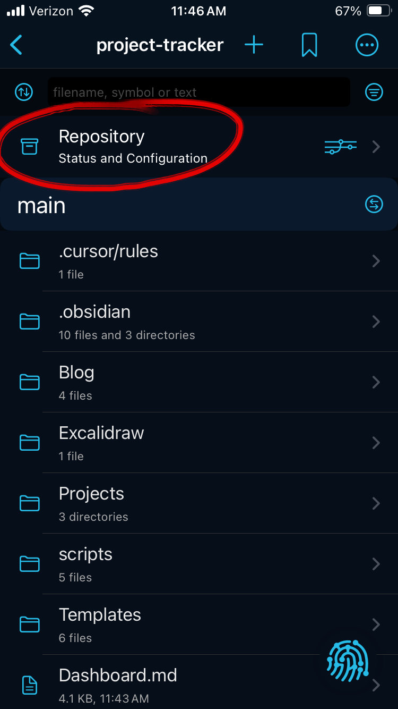
9. Tap the repo name at the top of the screen—it should have an arrow next to it
10. Select the `Link Repository to` button

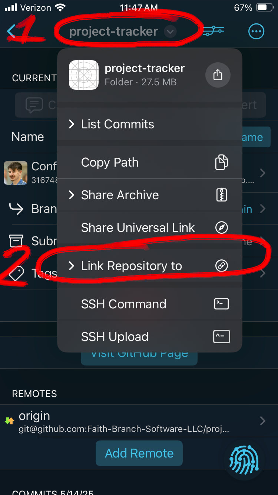
11. Now select the `Directory` option

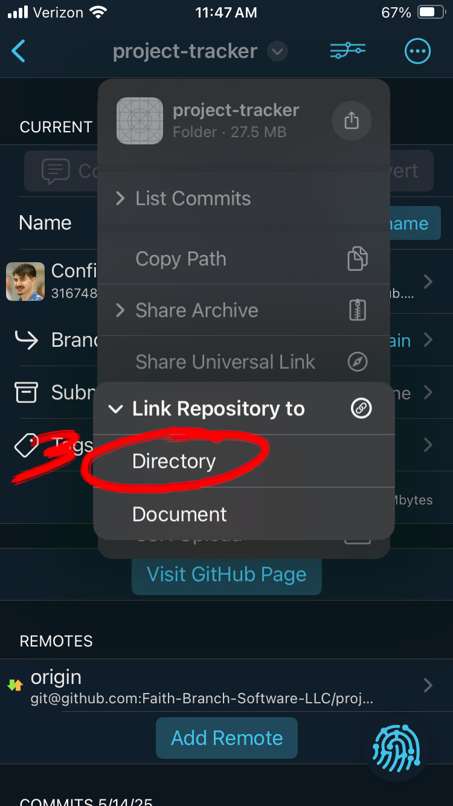
12. Now navigate to the vault you created in [Step 2: Create a Vault on mobile](#step-2-create-a-vault-on-mobile). This is just navigating through the files app. Mine was found at `Browse > On My iPhone > Obsidian > Project Tracker`.
13. Make sure you are in the vault folder and press the `Open` button

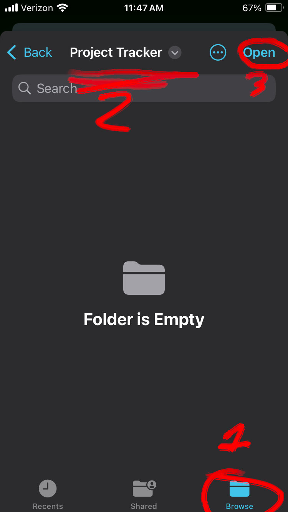
14. Reopen Obsidian and the vault should have updated with the repository. For me, I already started the vault on desktop, so I had to trust the author (myself) and enable plugins.

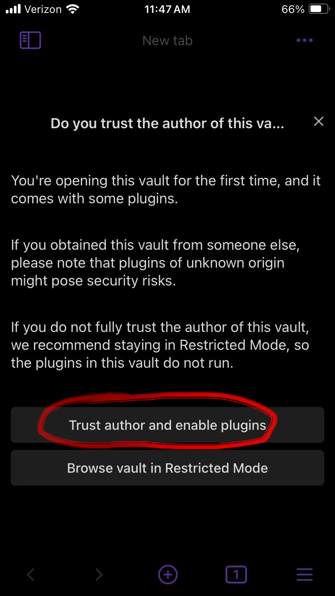
15. Go into the menu and into the `Community plugins` tab
16. Press the `Turn on and reload` button. This just allows community plugins, so I guess don't turn it on if you don't want them.

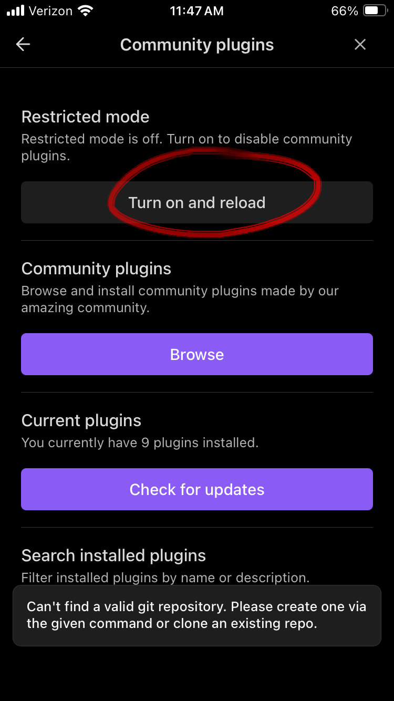
If you already had a started vault this is what the notes could look like in obsidian

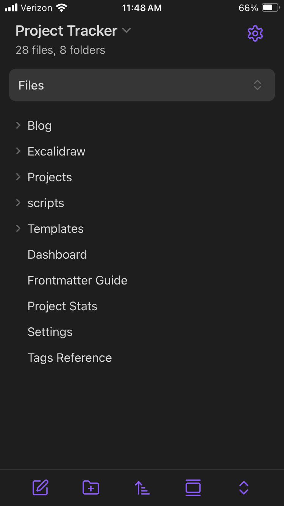

## Step 4: Saving Edits

Saving to Git is one side of the coin. If you want to work on desktop with updated notes this is crucial.

1. Go into Working Copy
2. Open the repository and select the `Repository` button
3. Press the `Commit` button

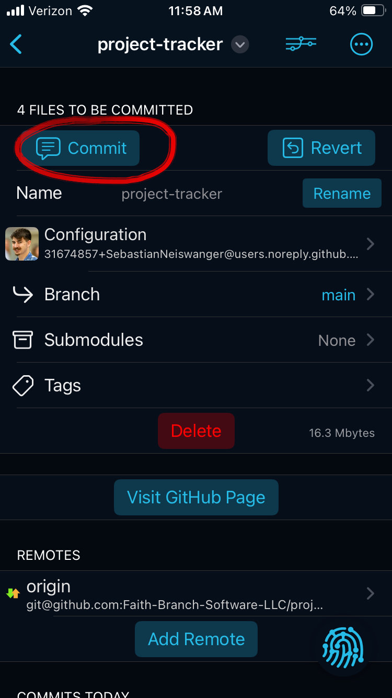
These can be done in basically any order. But I recommend:

1. Press the `Add` button, to stage all the changes
2. Name your commit something that makes sense for the work you did
3. Select the `Push` switch to make it green. This just saves a step later. 
4. Once everything is good, select the `Commit` button. This will commit and push the changes to your provider. If you had remote changes and forgot to pull them, then it will let you know. Just pull the changes (see [Step 5: Receiving Edits](#step-5-receiving-edits)) and then repeat this step.

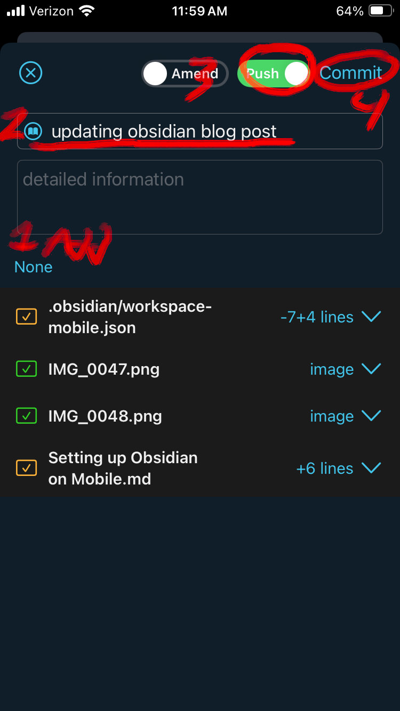

## Step 5: Receiving Edits

This is the other side of the coin. More often than not, you should do this step before making any changes. If you have pushed changes on another device it is recommended you pull all the changes before doing any work.

1. Pull down on the screen in the repository. This will fetch any changes from the provider.

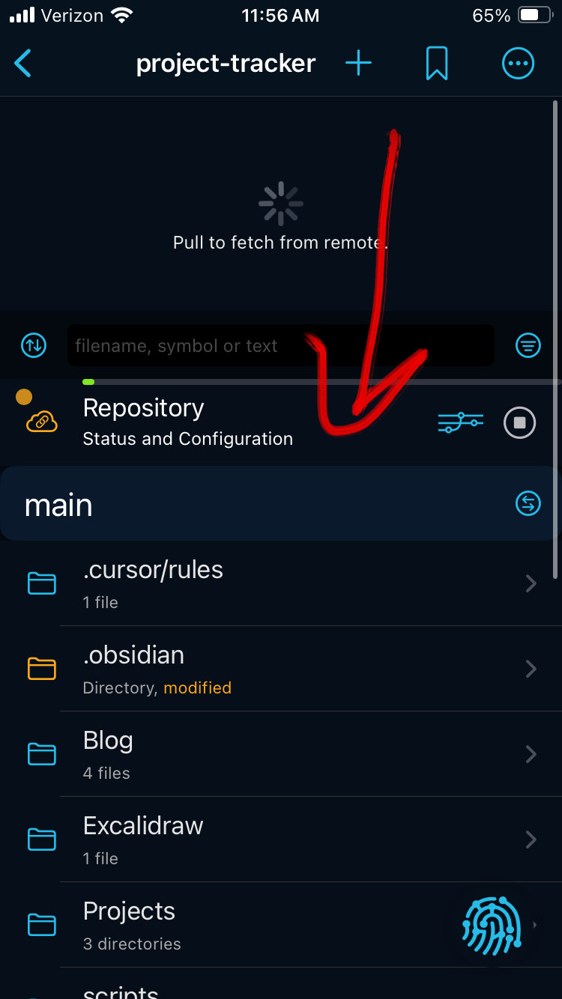
2. If you have any changes just click the green banner and it will merge them onto your device.

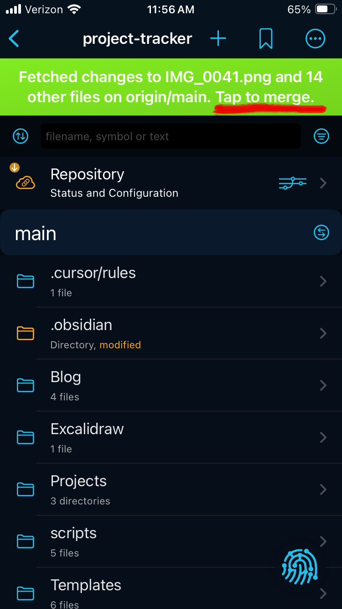

---

## End

I hope this is helpful to others. At the very least, I know it'll be useful for me when setting up Obsidian again in the future. If I encounter any significant changes as updates come, I'll make sure to update this post.

There are so many more features and things you can do with Git that I didn't go into here. Feel free to use branches to your hearts content and have fun.
